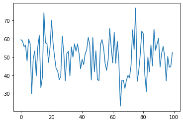

      Array的使用：「能用Array 就不要用List」   
今有一個List 紀錄美元的價格，   
要換算成台幣價格時，   
可以將List 直接轉成 Array，   
會比用for迴圈轉快很多   


```python
%matplotlib inline
import matplotlib.pyplot as plt
import numpy as np
```


```python
L = [10,20,30]
```


```python
e = 27.5
```


```python
price = np.array(L)
```


```python
price = price*e
```


```python
price
```


    array([275., 550., 825.])


也可以轉小數


```python
M = [12.3,23.4,34.5]
```


```python
price_M = np.array(M)
```


```python
price_M = price_M*e
```


```python
price_M
```


    array([338.25, 643.5 , 948.75])


用 Array 算成績


```python
score = np.array([90,80,95])
weight = np.array([.3,.4,.3])
result = score*weight
result.sum()
```


    87.5


用 Array 算成績，快速版


```python
np.dot(score,weight)
```


    87.5


Array 也可以是二維的  
以下計算全班成績  
每位同學有三個成績  
都可以直接用內積算成績


```python
score_total = np.array([[90,80,95],[40,30,40],[50,80,90],[86,30,90],[90,80,90]])
weight = np.array([.3,.4,.3])
np.dot(score_total,weight)
```


    array([87.5, 36. , 74. , 64.8, 86. ])


array 也可以用 shape reshape 來改變形狀


```python
score_total = np.array(np.random.randn(100))
```


```python
score_total
```


    array([ 0.94483658,  0.87487624,  0.5743388 ,  0.64328148, -0.21959765,
            0.97602218,  0.73147217, -2.00370937, -0.1155098 ,  0.32950302,
           -1.03317422,  0.55358044,  1.17662563, -1.6784363 , -1.11719329,
            2.41819896,  0.76914261,  0.74313956, -0.29777012,  0.51561204,
            1.99746024,  0.74147216, -0.00875078, -0.64345636, -0.75915075,
           -1.23644315, -1.07524529,  1.1332929 ,  0.2192992 , -1.2927197 ,
            0.19402122,  0.30136349, -1.03871155,  0.55069898, -0.01337644,
            0.71854745,  0.31408463,  0.71283407,  0.18061616, -0.6498176 ,
           -0.12932445, -0.41844665,  0.18158622,  0.39758041,  1.06684452,
            0.67209837, -1.26078466,  1.0625714 , -0.80630612,  0.34010865,
           -1.23403522, -1.28895152,  0.69270414,  0.94814321,  0.53186974,
           -0.3305466 , -0.73256092, -0.17529047,  1.5476013 ,  0.53367197,
           -0.32125368,  1.36162737, -0.34436013,  0.8645473 , -0.16956438,
           -2.68592205, -1.26665244, -1.28144855, -1.71700106, -1.2573001 ,
           -1.01093897, -1.13602428, -0.46093293,  1.48076418,  0.40466333,
            2.67454077, -1.34090979, -0.78903983,  0.11066809,  1.41809708,
            1.27062181, -0.96212443, -1.88239689, -0.0043315 , -0.81048144,
            0.65395371, -0.49098678,  1.52028061,  0.36692794,  0.69588529,
            1.02168973, -0.54920762,  0.19850892,  0.57514788,  0.04824916,
           -1.29971071,  0.02744774, -0.55981201, -0.51769237,  0.23844712])


```python
score_total.shape
```


    (100,)


可以使用 array 直接乘倍數和加數字來調分，調成平均50,標準差10


```python
adj_score = score_total*10 +50
```


```python
adj_score
```


    array([59.44836584, 58.74876245, 55.74338798, 56.43281484, 47.80402351,
           59.76022177, 57.31472167, 29.9629063 , 48.84490196, 53.2950302 ,
           39.66825784, 55.53580442, 61.76625628, 33.21563699, 38.82806714,
           74.1819896 , 57.69142615, 57.4313956 , 47.02229877, 55.15612038,
           69.97460243, 57.41472159, 49.91249222, 43.56543636, 42.4084925 ,
           37.63556847, 39.24754709, 61.33292897, 52.19299202, 37.07280296,
           51.94021219, 53.01363493, 39.61288445, 55.50698977, 49.86623558,
           57.18547446, 53.14084627, 57.12834065, 51.8061616 , 43.50182402,
           48.70675555, 45.81553353, 51.81586219, 53.9758041 , 60.66844518,
           56.72098374, 37.39215337, 60.62571401, 41.9369388 , 53.40108647,
           37.65964779, 37.11048476, 56.92704139, 59.48143207, 55.31869738,
           46.69453401, 42.67439081, 48.24709526, 65.476013  , 55.33671965,
           46.78746325, 63.61627371, 46.55639868, 58.64547305, 48.30435625,
           23.14077948, 37.33347555, 37.18551452, 32.82998938, 37.42699897,
           39.89061034, 38.63975724, 45.39067072, 64.80764175, 54.04663327,
           76.74540767, 36.5909021 , 42.10960167, 51.10668093, 64.18097079,
           62.70621813, 40.37875572, 31.17603114, 49.95668504, 41.89518563,
           56.5395371 , 45.09013221, 65.20280605, 53.66927942, 56.95885285,
           60.21689735, 44.50792376, 51.9850892 , 55.75147881, 50.48249165,
           37.00289293, 50.27447738, 44.40187993, 44.82307634, 52.38447124])


```python
plt.plot(adj_score)
```


    [<matplotlib.lines.Line2D at 0x11a4c0b20>]


    

    


shape 可以改變  array 的形狀


```python
adj_score.shape =(5,20)
```


```python
adj_score
```


    array([[59.44836584, 58.74876245, 55.74338798, 56.43281484, 47.80402351,
            59.76022177, 57.31472167, 29.9629063 , 48.84490196, 53.2950302 ,
            39.66825784, 55.53580442, 61.76625628, 33.21563699, 38.82806714,
            74.1819896 , 57.69142615, 57.4313956 , 47.02229877, 55.15612038],
           [69.97460243, 57.41472159, 49.91249222, 43.56543636, 42.4084925 ,
            37.63556847, 39.24754709, 61.33292897, 52.19299202, 37.07280296,
            51.94021219, 53.01363493, 39.61288445, 55.50698977, 49.86623558,
            57.18547446, 53.14084627, 57.12834065, 51.8061616 , 43.50182402],
           [48.70675555, 45.81553353, 51.81586219, 53.9758041 , 60.66844518,
            56.72098374, 37.39215337, 60.62571401, 41.9369388 , 53.40108647,
            37.65964779, 37.11048476, 56.92704139, 59.48143207, 55.31869738,
            46.69453401, 42.67439081, 48.24709526, 65.476013  , 55.33671965],
           [46.78746325, 63.61627371, 46.55639868, 58.64547305, 48.30435625,
            23.14077948, 37.33347555, 37.18551452, 32.82998938, 37.42699897,
            39.89061034, 38.63975724, 45.39067072, 64.80764175, 54.04663327,
            76.74540767, 36.5909021 , 42.10960167, 51.10668093, 64.18097079],
           [62.70621813, 40.37875572, 31.17603114, 49.95668504, 41.89518563,
            56.5395371 , 45.09013221, 65.20280605, 53.66927942, 56.95885285,
            60.21689735, 44.50792376, 51.9850892 , 55.75147881, 50.48249165,
            37.00289293, 50.27447738, 44.40187993, 44.82307634, 52.38447124]])


reshape 也可以改變 array 形狀，只是不會存在原本的array裡面，想要存的話要再自己令


```python
adj_score.reshape(10,10)
```


    array([[59.44836584, 58.74876245, 55.74338798, 56.43281484, 47.80402351,
            59.76022177, 57.31472167, 29.9629063 , 48.84490196, 53.2950302 ],
           [39.66825784, 55.53580442, 61.76625628, 33.21563699, 38.82806714,
            74.1819896 , 57.69142615, 57.4313956 , 47.02229877, 55.15612038],
           [69.97460243, 57.41472159, 49.91249222, 43.56543636, 42.4084925 ,
            37.63556847, 39.24754709, 61.33292897, 52.19299202, 37.07280296],
           [51.94021219, 53.01363493, 39.61288445, 55.50698977, 49.86623558,
            57.18547446, 53.14084627, 57.12834065, 51.8061616 , 43.50182402],
           [48.70675555, 45.81553353, 51.81586219, 53.9758041 , 60.66844518,
            56.72098374, 37.39215337, 60.62571401, 41.9369388 , 53.40108647],
           [37.65964779, 37.11048476, 56.92704139, 59.48143207, 55.31869738,
            46.69453401, 42.67439081, 48.24709526, 65.476013  , 55.33671965],
           [46.78746325, 63.61627371, 46.55639868, 58.64547305, 48.30435625,
            23.14077948, 37.33347555, 37.18551452, 32.82998938, 37.42699897],
           [39.89061034, 38.63975724, 45.39067072, 64.80764175, 54.04663327,
            76.74540767, 36.5909021 , 42.10960167, 51.10668093, 64.18097079],
           [62.70621813, 40.37875572, 31.17603114, 49.95668504, 41.89518563,
            56.5395371 , 45.09013221, 65.20280605, 53.66927942, 56.95885285],
           [60.21689735, 44.50792376, 51.9850892 , 55.75147881, 50.48249165,
            37.00289293, 50.27447738, 44.40187993, 44.82307634, 52.38447124]])


adj_score 一樣還是5 * 20


```python
adj_score
```


    array([[59.44836584, 58.74876245, 55.74338798, 56.43281484, 47.80402351,
            59.76022177, 57.31472167, 29.9629063 , 48.84490196, 53.2950302 ,
            39.66825784, 55.53580442, 61.76625628, 33.21563699, 38.82806714,
            74.1819896 , 57.69142615, 57.4313956 , 47.02229877, 55.15612038],
           [69.97460243, 57.41472159, 49.91249222, 43.56543636, 42.4084925 ,
            37.63556847, 39.24754709, 61.33292897, 52.19299202, 37.07280296,
            51.94021219, 53.01363493, 39.61288445, 55.50698977, 49.86623558,
            57.18547446, 53.14084627, 57.12834065, 51.8061616 , 43.50182402],
           [48.70675555, 45.81553353, 51.81586219, 53.9758041 , 60.66844518,
            56.72098374, 37.39215337, 60.62571401, 41.9369388 , 53.40108647,
            37.65964779, 37.11048476, 56.92704139, 59.48143207, 55.31869738,
            46.69453401, 42.67439081, 48.24709526, 65.476013  , 55.33671965],
           [46.78746325, 63.61627371, 46.55639868, 58.64547305, 48.30435625,
            23.14077948, 37.33347555, 37.18551452, 32.82998938, 37.42699897,
            39.89061034, 38.63975724, 45.39067072, 64.80764175, 54.04663327,
            76.74540767, 36.5909021 , 42.10960167, 51.10668093, 64.18097079],
           [62.70621813, 40.37875572, 31.17603114, 49.95668504, 41.89518563,
            56.5395371 , 45.09013221, 65.20280605, 53.66927942, 56.95885285,
            60.21689735, 44.50792376, 51.9850892 , 55.75147881, 50.48249165,
            37.00289293, 50.27447738, 44.40187993, 44.82307634, 52.38447124]])


```python
adj_score = adj_score.reshape(10,10)
```

這樣子array 形狀就改了


```python
adj_score
```


    array([[59.44836584, 58.74876245, 55.74338798, 56.43281484, 47.80402351,
            59.76022177, 57.31472167, 29.9629063 , 48.84490196, 53.2950302 ],
           [39.66825784, 55.53580442, 61.76625628, 33.21563699, 38.82806714,
            74.1819896 , 57.69142615, 57.4313956 , 47.02229877, 55.15612038],
           [69.97460243, 57.41472159, 49.91249222, 43.56543636, 42.4084925 ,
            37.63556847, 39.24754709, 61.33292897, 52.19299202, 37.07280296],
           [51.94021219, 53.01363493, 39.61288445, 55.50698977, 49.86623558,
            57.18547446, 53.14084627, 57.12834065, 51.8061616 , 43.50182402],
           [48.70675555, 45.81553353, 51.81586219, 53.9758041 , 60.66844518,
            56.72098374, 37.39215337, 60.62571401, 41.9369388 , 53.40108647],
           [37.65964779, 37.11048476, 56.92704139, 59.48143207, 55.31869738,
            46.69453401, 42.67439081, 48.24709526, 65.476013  , 55.33671965],
           [46.78746325, 63.61627371, 46.55639868, 58.64547305, 48.30435625,
            23.14077948, 37.33347555, 37.18551452, 32.82998938, 37.42699897],
           [39.89061034, 38.63975724, 45.39067072, 64.80764175, 54.04663327,
            76.74540767, 36.5909021 , 42.10960167, 51.10668093, 64.18097079],
           [62.70621813, 40.37875572, 31.17603114, 49.95668504, 41.89518563,
            56.5395371 , 45.09013221, 65.20280605, 53.66927942, 56.95885285],
           [60.21689735, 44.50792376, 51.9850892 , 55.75147881, 50.48249165,
            37.00289293, 50.27447738, 44.40187993, 44.82307634, 52.38447124]])


    Array 的快速生成法  
 可以使用List 轉 Array


```python
xy = [[x,y] for x in range(10) for y in range(5)]
```


```python
xy = np.array(xy)
```


```python
xy.shape= (2,5,10)
```


```python
xy
```


    array([[[0, 0, 0, 1, 0, 2, 0, 3, 0, 4],
            [1, 0, 1, 1, 1, 2, 1, 3, 1, 4],
            [2, 0, 2, 1, 2, 2, 2, 3, 2, 4],
            [3, 0, 3, 1, 3, 2, 3, 3, 3, 4],
            [4, 0, 4, 1, 4, 2, 4, 3, 4, 4]],
    
           [[5, 0, 5, 1, 5, 2, 5, 3, 5, 4],
            [6, 0, 6, 1, 6, 2, 6, 3, 6, 4],
            [7, 0, 7, 1, 7, 2, 7, 3, 7, 4],
            [8, 0, 8, 1, 8, 2, 8, 3, 8, 4],
            [9, 0, 9, 1, 9, 2, 9, 3, 9, 4]]])


```python

```
