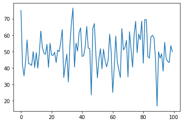
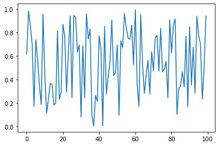
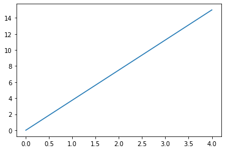
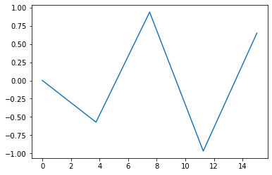
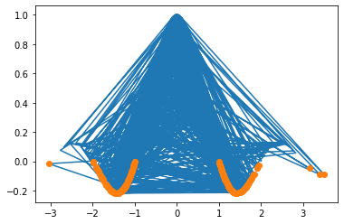

      Array的使用：「能用Array 就不要用List」   
今有一個List 紀錄美元的價格，   
要換算成台幣價格時，   
可以將List 直接轉成 Array，   
會比用for迴圈轉快很多   


```python
%matplotlib inline
import matplotlib.pyplot as plt
import numpy as np
```


```python
L = [10,20,30]
```


```python
e = 27.5
```


```python
price = np.array(L)
```


```python
price = price*e
```


```python
price
```


    array([275., 550., 825.])


也可以轉小數


```python
M = [12.3,23.4,34.5]
```


```python
price_M = np.array(M)
```


```python
price_M = price_M*e
```


```python
price_M
```


    array([338.25, 643.5 , 948.75])


用 Array 算成績


```python
score = np.array([90,80,95])
weight = np.array([.3,.4,.3])
result = score*weight
result.sum()
```


    87.5


用 Array 算成績，快速版


```python
np.dot(score,weight)
```


    87.5


Array 也可以是二維的  
以下計算全班成績  
每位同學有三個成績  
都可以直接用內積算成績


```python
score_total = np.array([[90,80,95],[40,30,40],[50,80,90],[86,30,90],[90,80,90]])
weight = np.array([.3,.4,.3])
np.dot(score_total,weight)
```


    array([87.5, 36. , 74. , 64.8, 86. ])


array 也可以用 shape reshape 來改變形狀


```python
score_total = np.array(np.random.randn(100))
```


```python
score_total
```


    array([ 2.49510454e+00, -8.23266985e-01, -1.48497835e+00, -6.27451749e-01,
            7.03184683e-01, -7.40464668e-01, -7.64148671e-01, -8.51413891e-01,
           -6.68333125e-04, -9.73489452e-01, -6.61069500e-02, -1.01069597e+00,
           -8.93683715e-02,  1.24293675e+00,  2.49197717e-01, -8.73382753e-02,
           -1.72143971e-01,  4.33435261e-01, -9.63706483e-01,  4.99808748e-01,
           -2.03663248e-01, -2.38901849e-01, -3.90437291e-02, -6.76595352e-01,
            8.59766181e-02, -5.16155764e-03,  5.47088703e-01,  1.33607168e+00,
           -1.58302652e+00, -8.07240634e-01, -1.60124722e-01, -1.84914434e+00,
            4.06454992e-01,  1.72427379e+00,  2.64253442e+00, -9.36605194e-01,
            5.12174765e-01,  2.44177263e-02,  1.13353549e+00,  1.44090137e+00,
           -2.94245482e-01, -2.64033226e-01,  2.84303940e-01,  1.53084375e+00,
            2.09859681e-01,  1.77517362e-01, -2.63705652e+00,  1.41456066e+00,
            1.69776688e+00, -1.90245564e-01, -1.59943336e+00, -4.43518047e-01,
            1.68982144e-01, -1.05214839e+00,  1.36828625e-01, -5.41468763e-01,
           -9.32299488e-01, -5.52738423e-01,  1.05961130e+00, -1.28983961e-03,
           -2.49325731e+00, -1.00264551e+00,  9.34267847e-01, -6.24597683e-01,
           -1.10550135e+00, -1.58119063e+00,  1.39464789e+00,  9.76035686e-02,
            2.34319510e-01,  6.78042008e-01, -1.54067537e+00,  1.20067108e+00,
            1.17002593e-01, -9.52174640e-01,  1.01051715e+00,  1.83447945e+00,
           -7.61247990e-02,  1.05952488e+00,  7.19691633e-01,  1.84870082e+00,
           -7.13597410e-01,  1.94327815e+00,  1.93669672e+00, -3.06566789e-01,
           -3.97810281e-01,  8.77272970e-01,  9.85005816e-01,  8.43550865e-01,
           -4.66601077e-01, -3.31989625e+00, -1.45586997e-02, -4.05862459e-01,
           -1.32868124e-01, -1.19359687e+00,  5.58727652e-01, -4.35217484e-01,
           -6.11075689e-01, -6.70814984e-01,  3.60945940e-01, -1.84080537e-02])


```python
score_total.shape
```


    (100,)


可以使用 array 直接乘倍數和加數字來調分，調成平均50,標準差10


```python
adj_score = score_total*10 +50
```


```python
adj_score
```


    array([74.95104544, 41.76733015, 35.15021648, 43.72548251, 57.03184683,
           42.59535332, 42.35851329, 41.48586109, 49.99331667, 40.26510548,
           49.3389305 , 39.89304027, 49.10631629, 62.42936745, 52.49197717,
           49.12661725, 48.27856029, 54.33435261, 40.36293517, 54.99808748,
           47.96336752, 47.61098151, 49.60956271, 43.23404648, 50.85976618,
           49.94838442, 55.47088703, 63.3607168 , 34.16973483, 41.92759366,
           48.39875278, 31.5085566 , 54.06454992, 67.24273792, 76.42534422,
           40.63394806, 55.12174765, 50.24417726, 61.33535493, 64.40901367,
           47.05754518, 47.35966774, 52.8430394 , 65.30843753, 52.09859681,
           51.77517362, 23.62943479, 64.14560655, 66.97766881, 48.09754436,
           34.00566639, 45.56481953, 51.68982144, 39.47851613, 51.36828625,
           44.58531237, 40.67700512, 44.47261577, 60.59611296, 49.9871016 ,
           25.06742688, 39.97354494, 59.34267847, 43.75402317, 38.94498651,
           34.18809372, 63.94647886, 50.97603569, 52.3431951 , 56.78042008,
           34.59324631, 62.00671084, 51.17002593, 40.4782536 , 60.10517151,
           68.34479446, 49.23875201, 60.59524878, 57.19691633, 68.48700824,
           42.8640259 , 69.43278155, 69.3669672 , 46.93433211, 46.02189719,
           58.7727297 , 59.85005816, 58.43550865, 45.33398923, 16.80103746,
           49.854413  , 45.94137541, 48.67131876, 38.06403128, 55.58727652,
           45.64782516, 43.88924311, 43.29185016, 53.6094594 , 49.81591946])


```python
plt.plot(adj_score)
```


    [<matplotlib.lines.Line2D at 0x112e5d100>]


    

    


shape 可以改變  array 的形狀


```python
adj_score.shape =(5,20)
```


```python
adj_score
```


    array([[74.95104544, 41.76733015, 35.15021648, 43.72548251, 57.03184683,
            42.59535332, 42.35851329, 41.48586109, 49.99331667, 40.26510548,
            49.3389305 , 39.89304027, 49.10631629, 62.42936745, 52.49197717,
            49.12661725, 48.27856029, 54.33435261, 40.36293517, 54.99808748],
           [47.96336752, 47.61098151, 49.60956271, 43.23404648, 50.85976618,
            49.94838442, 55.47088703, 63.3607168 , 34.16973483, 41.92759366,
            48.39875278, 31.5085566 , 54.06454992, 67.24273792, 76.42534422,
            40.63394806, 55.12174765, 50.24417726, 61.33535493, 64.40901367],
           [47.05754518, 47.35966774, 52.8430394 , 65.30843753, 52.09859681,
            51.77517362, 23.62943479, 64.14560655, 66.97766881, 48.09754436,
            34.00566639, 45.56481953, 51.68982144, 39.47851613, 51.36828625,
            44.58531237, 40.67700512, 44.47261577, 60.59611296, 49.9871016 ],
           [25.06742688, 39.97354494, 59.34267847, 43.75402317, 38.94498651,
            34.18809372, 63.94647886, 50.97603569, 52.3431951 , 56.78042008,
            34.59324631, 62.00671084, 51.17002593, 40.4782536 , 60.10517151,
            68.34479446, 49.23875201, 60.59524878, 57.19691633, 68.48700824],
           [42.8640259 , 69.43278155, 69.3669672 , 46.93433211, 46.02189719,
            58.7727297 , 59.85005816, 58.43550865, 45.33398923, 16.80103746,
            49.854413  , 45.94137541, 48.67131876, 38.06403128, 55.58727652,
            45.64782516, 43.88924311, 43.29185016, 53.6094594 , 49.81591946]])


reshape 也可以改變 array 形狀，只是不會存在原本的array裡面，想要存的話要再自己令


```python
adj_score.reshape(10,10)
```


    array([[74.95104544, 41.76733015, 35.15021648, 43.72548251, 57.03184683,
            42.59535332, 42.35851329, 41.48586109, 49.99331667, 40.26510548],
           [49.3389305 , 39.89304027, 49.10631629, 62.42936745, 52.49197717,
            49.12661725, 48.27856029, 54.33435261, 40.36293517, 54.99808748],
           [47.96336752, 47.61098151, 49.60956271, 43.23404648, 50.85976618,
            49.94838442, 55.47088703, 63.3607168 , 34.16973483, 41.92759366],
           [48.39875278, 31.5085566 , 54.06454992, 67.24273792, 76.42534422,
            40.63394806, 55.12174765, 50.24417726, 61.33535493, 64.40901367],
           [47.05754518, 47.35966774, 52.8430394 , 65.30843753, 52.09859681,
            51.77517362, 23.62943479, 64.14560655, 66.97766881, 48.09754436],
           [34.00566639, 45.56481953, 51.68982144, 39.47851613, 51.36828625,
            44.58531237, 40.67700512, 44.47261577, 60.59611296, 49.9871016 ],
           [25.06742688, 39.97354494, 59.34267847, 43.75402317, 38.94498651,
            34.18809372, 63.94647886, 50.97603569, 52.3431951 , 56.78042008],
           [34.59324631, 62.00671084, 51.17002593, 40.4782536 , 60.10517151,
            68.34479446, 49.23875201, 60.59524878, 57.19691633, 68.48700824],
           [42.8640259 , 69.43278155, 69.3669672 , 46.93433211, 46.02189719,
            58.7727297 , 59.85005816, 58.43550865, 45.33398923, 16.80103746],
           [49.854413  , 45.94137541, 48.67131876, 38.06403128, 55.58727652,
            45.64782516, 43.88924311, 43.29185016, 53.6094594 , 49.81591946]])


adj_score 一樣還是5 * 20


```python
adj_score
```


    array([[74.95104544, 41.76733015, 35.15021648, 43.72548251, 57.03184683,
            42.59535332, 42.35851329, 41.48586109, 49.99331667, 40.26510548,
            49.3389305 , 39.89304027, 49.10631629, 62.42936745, 52.49197717,
            49.12661725, 48.27856029, 54.33435261, 40.36293517, 54.99808748],
           [47.96336752, 47.61098151, 49.60956271, 43.23404648, 50.85976618,
            49.94838442, 55.47088703, 63.3607168 , 34.16973483, 41.92759366,
            48.39875278, 31.5085566 , 54.06454992, 67.24273792, 76.42534422,
            40.63394806, 55.12174765, 50.24417726, 61.33535493, 64.40901367],
           [47.05754518, 47.35966774, 52.8430394 , 65.30843753, 52.09859681,
            51.77517362, 23.62943479, 64.14560655, 66.97766881, 48.09754436,
            34.00566639, 45.56481953, 51.68982144, 39.47851613, 51.36828625,
            44.58531237, 40.67700512, 44.47261577, 60.59611296, 49.9871016 ],
           [25.06742688, 39.97354494, 59.34267847, 43.75402317, 38.94498651,
            34.18809372, 63.94647886, 50.97603569, 52.3431951 , 56.78042008,
            34.59324631, 62.00671084, 51.17002593, 40.4782536 , 60.10517151,
            68.34479446, 49.23875201, 60.59524878, 57.19691633, 68.48700824],
           [42.8640259 , 69.43278155, 69.3669672 , 46.93433211, 46.02189719,
            58.7727297 , 59.85005816, 58.43550865, 45.33398923, 16.80103746,
            49.854413  , 45.94137541, 48.67131876, 38.06403128, 55.58727652,
            45.64782516, 43.88924311, 43.29185016, 53.6094594 , 49.81591946]])


```python
adj_score = adj_score.reshape(10,10)
```

這樣子array 形狀就改了


```python
adj_score
```


    array([[74.95104544, 41.76733015, 35.15021648, 43.72548251, 57.03184683,
            42.59535332, 42.35851329, 41.48586109, 49.99331667, 40.26510548],
           [49.3389305 , 39.89304027, 49.10631629, 62.42936745, 52.49197717,
            49.12661725, 48.27856029, 54.33435261, 40.36293517, 54.99808748],
           [47.96336752, 47.61098151, 49.60956271, 43.23404648, 50.85976618,
            49.94838442, 55.47088703, 63.3607168 , 34.16973483, 41.92759366],
           [48.39875278, 31.5085566 , 54.06454992, 67.24273792, 76.42534422,
            40.63394806, 55.12174765, 50.24417726, 61.33535493, 64.40901367],
           [47.05754518, 47.35966774, 52.8430394 , 65.30843753, 52.09859681,
            51.77517362, 23.62943479, 64.14560655, 66.97766881, 48.09754436],
           [34.00566639, 45.56481953, 51.68982144, 39.47851613, 51.36828625,
            44.58531237, 40.67700512, 44.47261577, 60.59611296, 49.9871016 ],
           [25.06742688, 39.97354494, 59.34267847, 43.75402317, 38.94498651,
            34.18809372, 63.94647886, 50.97603569, 52.3431951 , 56.78042008],
           [34.59324631, 62.00671084, 51.17002593, 40.4782536 , 60.10517151,
            68.34479446, 49.23875201, 60.59524878, 57.19691633, 68.48700824],
           [42.8640259 , 69.43278155, 69.3669672 , 46.93433211, 46.02189719,
            58.7727297 , 59.85005816, 58.43550865, 45.33398923, 16.80103746],
           [49.854413  , 45.94137541, 48.67131876, 38.06403128, 55.58727652,
            45.64782516, 43.88924311, 43.29185016, 53.6094594 , 49.81591946]])


 ## Array 的快速生成法  
 1.可以使用List 轉 Array


```python
xy = [[x,y] for x in range(10) for y in range(5)]
```


```python
xy = np.array(xy)
```


```python
xy.shape= (2,5,10)
```


```python
xy
```


    array([[[0, 0, 0, 1, 0, 2, 0, 3, 0, 4],
            [1, 0, 1, 1, 1, 2, 1, 3, 1, 4],
            [2, 0, 2, 1, 2, 2, 2, 3, 2, 4],
            [3, 0, 3, 1, 3, 2, 3, 3, 3, 4],
            [4, 0, 4, 1, 4, 2, 4, 3, 4, 4]],
    
           [[5, 0, 5, 1, 5, 2, 5, 3, 5, 4],
            [6, 0, 6, 1, 6, 2, 6, 3, 6, 4],
            [7, 0, 7, 1, 7, 2, 7, 3, 7, 4],
            [8, 0, 8, 1, 8, 2, 8, 3, 8, 4],
            [9, 0, 9, 1, 9, 2, 9, 3, 9, 4]]])


2.可以使用快速生成一定範圍的Array


```python
XY = [[X,Y] for X in range(10) for Y in range(5)]
```


```python
XY = np.array(XY)
```


```python
XY
```


    array([[0, 0],
           [0, 1],
           [0, 2],
           [0, 3],
           [0, 4],
           [1, 0],
           [1, 1],
           [1, 2],
           [1, 3],
           [1, 4],
           [2, 0],
           [2, 1],
           [2, 2],
           [2, 3],
           [2, 4],
           [3, 0],
           [3, 1],
           [3, 2],
           [3, 3],
           [3, 4],
           [4, 0],
           [4, 1],
           [4, 2],
           [4, 3],
           [4, 4],
           [5, 0],
           [5, 1],
           [5, 2],
           [5, 3],
           [5, 4],
           [6, 0],
           [6, 1],
           [6, 2],
           [6, 3],
           [6, 4],
           [7, 0],
           [7, 1],
           [7, 2],
           [7, 3],
           [7, 4],
           [8, 0],
           [8, 1],
           [8, 2],
           [8, 3],
           [8, 4],
           [9, 0],
           [9, 1],
           [9, 2],
           [9, 3],
           [9, 4]])


3.可以生成0,1 或單位矩陣


```python
np.zeros(10)
```


    array([0., 0., 0., 0., 0., 0., 0., 0., 0., 0.])


```python
np.zeros((3,4))
```


    array([[0., 0., 0., 0.],
           [0., 0., 0., 0.],
           [0., 0., 0., 0.]])


```python
np.ones(3)
```


    array([1., 1., 1.])


```python
np.eye(4)
```


    array([[1., 0., 0., 0.],
           [0., 1., 0., 0.],
           [0., 0., 1., 0.],
           [0., 0., 0., 1.]])


## Array 也可以用於畫圖


```python
x = np.random.rand(100)
```

上式可以產生 100個 0~1 的數


```python
plt.plot(x)
```


    [<matplotlib.lines.Line2D at 0x112f5d130>]


    

    


也可以畫 XY 座標


```python
x = np.linspace(0,15,5)
```

上式為在0~15之間取30個數


```python
plt.plot(x)
```


    [<matplotlib.lines.Line2D at 0x11309e430>]


    

    


```python
x
```


    array([ 0.  ,  3.75,  7.5 , 11.25, 15.  ])


```python
plt.plot(x,np.sin(x))
```


    [<matplotlib.lines.Line2D at 0x1131a3a30>]


    

    


## Array 快篩法


```python
x = np.random.randn(1000)
```

用此法可挑出x<0 的內容


```python
x[x<0]
```


    array([-0.12855716, -0.70486644, -0.89362817, -0.84988247, -1.69047752,
           -1.75472351, -1.16432635, -0.5827313 , -1.77380684, -1.89819193,
           -0.23974674, -0.88829582, -1.92213709, -2.77111207, -0.23905115,
           -1.22698314, -1.43864952, -0.30441513, -0.27154785, -0.2677239 ,
           -0.35082148, -0.16529903, -0.04363859, -0.80596467, -0.87828877,
           -0.60830026, -1.55663784, -0.09684421, -0.71736716, -0.64978116,
           -1.91596859, -1.26736202, -0.65601841, -1.14955088, -1.88483771,
           -0.33254391, -0.21115886, -1.02012246, -0.09080953, -0.40231032,
           -2.02322728, -0.32285517, -0.24846869, -0.83077517, -1.68034477,
           -0.8726498 , -0.12547818, -0.97160759, -0.13681111, -1.27690164,
           -0.681198  , -0.02076872, -0.47432514, -1.32203582, -1.13103563,
           -0.37576399, -1.27009293, -0.17205695, -0.45467809, -0.55202721,
           -0.61567381, -1.36602413, -0.14966974, -0.1137771 , -0.63191472,
           -1.37834149, -0.0189259 , -0.64279112, -2.04806785, -0.98447069,
           -0.32170291, -1.38879937, -0.45037632, -0.46329861, -1.03719815,
           -0.14635505, -0.98167913, -0.3172944 , -0.6876843 , -0.17899378,
           -1.01665311, -1.06712578, -0.58644576, -1.16048721, -1.36975577,
           -1.26456026, -0.77967682, -0.34933653, -0.70968163, -0.47087249,
           -0.45237153, -0.10910016, -0.0534387 , -0.97018114, -0.21401744,
           -0.40153646, -1.66933947, -1.90157814, -1.00260554, -0.90963679,
           -0.34067228, -1.19024037, -0.98710945, -0.75504293, -1.03133258,
           -0.22897967, -1.41368005, -0.99026586, -0.24248576, -1.08869267,
           -0.04331708, -0.36002805, -1.25665604, -0.16046115, -1.37908182,
           -0.21743419, -0.62761237, -0.29352094, -0.47929183, -1.6821472 ,
           -0.57847829, -0.47439187, -1.12603915, -0.25962848, -0.06172741,
           -1.23620943, -0.04167858, -0.01950451, -0.33243984, -0.50284244,
           -0.69376918, -0.32792821, -1.41637448, -1.20355187, -0.43921211,
           -1.70650371, -0.21838928, -1.47663435, -1.78137418, -2.18106805,
           -1.44739908, -0.97529943, -0.51376154, -0.6403775 , -2.69069568,
           -0.23273193, -1.33351473, -0.64248958, -0.25810713, -0.53411354,
           -0.91654572, -1.03391327, -0.49192823, -2.09929998, -0.09362753,
           -0.39063655, -0.48656265, -1.28955613, -0.27978364, -1.07991418,
           -1.19488706, -1.53812764, -0.70809423, -0.35314913, -2.05846667,
           -0.81205091, -0.58202785, -1.1761075 , -1.27314567, -0.83463645,
           -1.24439517, -0.66363582, -0.40459658, -1.3111749 , -0.60372496,
           -1.06990092, -0.46141109, -1.86774666, -0.96977701, -0.16750504,
           -0.85727643, -0.33632892, -1.62538434, -0.03064421, -0.55688469,
           -0.49855426, -0.43918787, -0.63989556, -1.38269893, -0.62617149,
           -0.64459636, -0.97985229, -3.04909623, -1.27023373, -0.34925594,
           -0.19253477, -0.35318872, -0.40808292, -0.745163  , -0.29467919,
           -0.11750408, -0.05116236, -0.43003362, -0.06555763, -0.36308837,
           -1.00374951, -0.7560788 , -0.69174731, -1.40396299, -0.53281177,
           -0.12409649, -0.79647248, -1.14263137, -0.0582188 , -0.92263938,
           -0.31795285, -0.70280397, -1.10046278, -1.44754039, -0.85915955,
           -1.5300541 , -1.10441265, -0.1340062 , -0.09238756, -0.11090168,
           -0.6268216 , -0.12500698, -0.36535461, -0.46225389, -0.72908753,
           -0.21366877, -0.88107823, -0.8250279 , -0.03944501, -0.23861303,
           -1.04059583, -0.79493804, -0.49931293, -1.97956794, -0.25110207,
           -0.03112357, -0.73584971, -0.92380894, -1.56093562, -0.41424532,
           -0.1557434 , -0.69118828, -0.03687657, -0.78774713, -0.1154666 ,
           -1.22795056, -0.12314518, -0.96966737, -0.52818446, -2.13852907,
           -1.12959973, -0.85141092, -0.6519202 , -0.18100554, -0.37964688,
           -0.48233431, -0.5974002 , -0.92081816, -0.65979894, -0.90692364,
           -0.22014501, -2.28011745, -0.42078937, -0.84971507, -0.89963818,
           -0.98706412, -0.50326604, -1.86925365, -0.77349092, -0.33597931,
           -0.00348708, -1.1536927 , -0.57412976, -1.08587074, -1.32214943,
           -0.05646832, -0.66753639, -0.01668918, -0.35918026, -0.71139481,
           -0.30201993, -0.17163657, -0.08128434, -0.22923345, -2.39876484,
           -0.29911064, -0.5795084 , -0.44344867, -1.29216503, -0.89215062,
           -0.76828768, -0.69923095, -0.06899153, -0.9783997 , -0.20053373,
           -0.81106821, -0.31680787, -0.8474161 , -1.21829042, -0.12095959,
           -0.50670995, -1.24442927, -0.202363  , -0.47935602, -0.66412865,
           -0.59460082, -0.53846232, -1.51879926, -1.43815133, -0.29775646,
           -1.4692855 , -0.18390262, -0.37623735, -1.0257473 , -0.12466946,
           -0.06731864, -0.29475817, -0.86454361, -0.84762808, -0.76882204,
           -1.62064649, -1.99210665, -1.43367566, -0.8719894 , -0.81253902,
           -0.66471737, -0.32160012, -1.22033525, -0.71213925, -1.27472618,
           -1.42975659, -0.66409146, -0.57971549, -0.60436874, -0.84327827,
           -0.61471556, -0.12561283, -0.9489136 , -0.21061231, -0.3324975 ,
           -0.44090473, -1.30294653, -0.70820398, -0.18241369, -0.53034002,
           -0.35299621, -0.01294705, -0.11702749, -1.79694255, -0.9175127 ,
           -0.05747681, -0.31677217, -1.0345268 , -0.67647515, -0.74299289,
           -1.63960111, -2.00210364, -0.49253145, -0.84957217, -0.6991127 ,
           -1.79140376, -0.23248478, -0.43158902, -1.55299086, -0.47571719,
           -1.01621272, -0.80674437, -0.12311687, -0.29652142, -1.67958788,
           -0.93304606, -0.5985658 , -1.02622444, -0.21273727, -0.33006637,
           -0.29327162, -0.25244021, -2.25272922, -1.084161  , -1.31268203,
           -0.76445187, -0.38471947, -0.6524363 , -0.75117441, -0.88668621,
           -0.18703923, -1.05005984, -1.06959117, -0.3026837 , -0.99010737,
           -1.16444827, -0.05059616, -0.05833522, -0.32446402, -0.03116456,
           -0.20869686, -0.13682653, -2.58226066, -0.89612649, -0.10741399,
           -2.17561629, -0.72836497, -1.11113829, -0.90375173, -0.43479101,
           -0.02632724, -0.70678026, -0.35813815, -1.74171247, -0.02058607,
           -0.24335727, -1.57489229, -1.57345899, -0.51159083, -0.83534776,
           -0.23214054, -0.181302  , -1.06274158, -0.7072544 , -0.36531456,
           -0.25024515, -0.23343837, -1.49613091, -0.79312514, -1.57401339,
           -0.3438363 , -0.33849416, -0.20745332, -0.09644625, -1.23045058,
           -1.15305306, -1.92583699, -2.30969662, -1.63955928, -0.38498701,
           -0.18517557, -1.41723144, -0.3201497 , -1.25447723, -1.17784634,
           -1.54206072, -1.99944518, -1.91614886, -1.11024293, -1.82053562,
           -0.56947124, -1.0784617 , -0.40242297, -0.24608724, -0.97570451,
           -2.54639826, -1.52200085, -2.06249646, -0.19476517, -0.99785979,
           -0.25633441, -1.64280733, -0.24308188, -0.16859125, -1.78668786,
           -1.60443242, -0.78807778, -0.08493132, -0.83416473, -0.95326847,
           -0.18129056, -0.08014616, -1.26694671, -0.23552392, -0.83893118,
           -0.50213826, -1.54879392, -0.03624061, -2.26751904, -0.74319599,
           -0.02157972, -0.68759123, -0.66226589, -0.84237494, -0.52020962,
           -0.85357889, -0.3756558 , -1.24650573, -1.83445324, -0.34181342,
           -0.7578644 , -1.75560036, -0.9722541 , -0.39166542, -0.10938043,
           -0.58680755, -2.06600444, -0.64253456, -0.38955736, -1.61871826,
           -0.71689167, -0.8283447 , -0.24167229, -1.56651726])


```python
x<0
```


    array([ True,  True, False,  True,  True,  True, False, False,  True,
            True, False,  True,  True,  True, False, False,  True,  True,
            True,  True, False, False, False, False, False, False, False,
            True,  True,  True, False, False,  True,  True,  True,  True,
           False,  True,  True, False, False,  True,  True, False,  True,
            True,  True,  True, False,  True, False, False, False,  True,
           False, False,  True,  True,  True,  True, False,  True, False,
            True,  True,  True,  True,  True, False, False, False, False,
           False, False,  True, False, False,  True, False,  True,  True,
           False,  True, False,  True, False, False, False, False,  True,
           False, False, False,  True, False, False,  True, False, False,
            True, False,  True, False,  True,  True,  True,  True, False,
            True,  True,  True, False,  True, False, False, False, False,
            True,  True, False,  True,  True, False,  True,  True,  True,
           False,  True, False,  True, False, False, False,  True, False,
            True,  True,  True,  True, False,  True, False, False,  True,
           False, False, False,  True, False,  True, False, False, False,
           False, False, False,  True, False,  True, False,  True, False,
            True,  True, False, False, False,  True,  True,  True,  True,
           False,  True,  True, False,  True,  True,  True,  True, False,
            True, False,  True,  True, False,  True,  True,  True,  True,
           False,  True,  True,  True, False, False, False,  True,  True,
           False, False,  True, False,  True, False,  True,  True, False,
            True, False, False, False, False,  True, False,  True, False,
           False, False,  True, False,  True,  True, False,  True,  True,
           False, False,  True,  True, False,  True, False, False, False,
           False, False,  True,  True,  True,  True, False, False,  True,
           False, False,  True, False, False,  True,  True,  True,  True,
           False, False,  True,  True,  True,  True, False,  True, False,
           False, False, False, False,  True,  True,  True,  True, False,
            True,  True,  True, False, False,  True, False, False, False,
           False,  True,  True,  True,  True,  True,  True, False, False,
           False, False, False,  True, False,  True, False, False,  True,
            True,  True, False, False, False,  True,  True, False,  True,
           False, False,  True,  True, False, False,  True, False,  True,
           False, False,  True,  True,  True,  True,  True,  True,  True,
            True, False, False, False,  True,  True, False, False,  True,
            True,  True,  True, False, False, False, False, False,  True,
            True, False, False, False,  True, False,  True, False, False,
            True, False,  True, False,  True, False,  True,  True, False,
            True,  True, False,  True, False,  True,  True,  True, False,
           False, False, False,  True, False, False,  True,  True,  True,
            True,  True, False,  True,  True,  True,  True,  True, False,
            True, False,  True, False,  True, False,  True, False, False,
            True,  True,  True,  True, False, False,  True,  True,  True,
           False, False, False, False,  True,  True,  True, False,  True,
            True,  True, False, False, False, False, False,  True, False,
           False, False, False,  True,  True,  True,  True,  True,  True,
           False,  True, False, False,  True, False,  True,  True,  True,
           False, False,  True, False, False,  True,  True, False,  True,
            True, False,  True,  True, False, False,  True,  True, False,
           False,  True, False, False, False,  True, False,  True, False,
           False,  True,  True, False, False, False, False,  True,  True,
            True, False,  True,  True, False, False, False, False, False,
            True,  True, False, False, False, False,  True, False,  True,
            True,  True, False,  True, False, False, False,  True, False,
           False,  True,  True, False, False,  True,  True, False,  True,
            True, False,  True, False, False, False,  True, False,  True,
            True,  True, False, False, False,  True,  True,  True,  True,
            True, False, False, False, False, False, False, False, False,
           False, False,  True, False,  True, False, False,  True, False,
           False,  True, False, False, False, False, False,  True,  True,
            True,  True, False,  True, False,  True, False,  True, False,
            True,  True,  True,  True, False, False, False, False, False,
            True, False, False, False, False,  True, False, False,  True,
           False, False,  True,  True, False, False,  True, False,  True,
           False, False,  True, False,  True, False, False, False, False,
           False,  True,  True, False, False, False, False, False,  True,
            True, False,  True, False, False,  True,  True, False, False,
            True, False,  True,  True, False, False, False, False, False,
            True,  True, False, False, False, False,  True,  True, False,
            True, False,  True, False, False, False,  True,  True, False,
            True,  True,  True,  True,  True, False,  True,  True,  True,
            True, False,  True, False, False,  True, False,  True, False,
           False,  True,  True, False,  True, False,  True,  True,  True,
           False, False,  True,  True, False,  True,  True, False, False,
           False,  True,  True, False,  True, False,  True, False, False,
            True, False, False,  True,  True,  True,  True, False,  True,
           False,  True,  True, False, False, False,  True, False, False,
           False, False,  True,  True, False,  True,  True, False,  True,
           False,  True,  True, False, False,  True, False,  True,  True,
           False,  True,  True,  True, False,  True,  True,  True,  True,
           False, False, False,  True,  True, False, False, False, False,
           False,  True, False,  True, False, False, False,  True,  True,
            True,  True, False,  True, False,  True,  True, False, False,
            True, False,  True,  True, False,  True, False,  True, False,
            True, False,  True, False, False, False, False, False, False,
           False,  True, False, False,  True,  True, False,  True,  True,
            True,  True,  True, False, False,  True,  True,  True,  True,
            True,  True, False, False, False, False, False,  True,  True,
           False,  True,  True,  True, False,  True, False,  True, False,
            True, False,  True, False,  True, False,  True,  True, False,
            True,  True,  True,  True, False,  True,  True, False, False,
            True,  True, False, False,  True, False,  True, False, False,
           False,  True, False,  True,  True,  True,  True, False, False,
            True, False,  True,  True, False, False, False,  True,  True,
           False, False,  True,  True,  True, False,  True, False,  True,
           False, False,  True,  True,  True, False,  True,  True, False,
           False,  True, False,  True,  True,  True,  True,  True, False,
            True,  True,  True,  True,  True,  True,  True,  True,  True,
            True, False, False,  True,  True, False, False, False,  True,
           False,  True,  True,  True, False, False, False,  True, False,
           False, False, False,  True,  True,  True, False, False,  True,
           False,  True,  True,  True, False, False, False, False, False,
           False, False, False, False,  True,  True,  True,  True,  True,
           False, False, False,  True,  True, False, False,  True,  True,
           False,  True,  True, False, False,  True,  True, False,  True,
           False,  True,  True,  True,  True,  True,  True, False,  True,
            True, False,  True,  True, False, False, False, False, False,
           False,  True, False,  True, False,  True,  True, False,  True,
           False, False, False,  True,  True, False, False,  True,  True,
           False])


```python
y = np.sinc(x)
```

可以應用到畫圖中


```python
plt.plot(x,y)
plt.plot(x[y<0],y[y<0],'o')
```


    [<matplotlib.lines.Line2D at 0x113234af0>]


    

    

